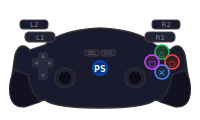

  <!-- ═══════════════════════════ HEADER ═══════════════════════════ -->
  <header class="header">
    

      ▶
      <h1>PS2 Web Emulator</h1>
    

    <nav class="header-nav">
      <button class="nav-btn active" data-tab="emulator">Emulator</button>
      <button class="nav-btn" data-tab="controls">Controls</button>
      <button class="nav-btn" data-tab="settings">Settings</button>
      <button class="nav-btn" data-tab="about">About</button>
    </nav>
  </header>

  <!-- ═══════════════════════════ TABS ════════════════════════════ -->

  <!-- TAB: EMULATOR -->
  <section id="tab-emulator" class="tab-section active">
    

      <!-- Left panel: controls -->
      <aside class="panel panel-left">
        

          <h3>Load Game</h3>
          

            
💿

            
Drop ISO / BIN / IMG here

            
or

            <label class="btn btn-primary" for="fileInput">Browse File</label>
            <input type="file" id="fileInput" accept=".iso,.bin,.img,.mdf" hidden />
          

          

            

              File:
              —
            

            

              Size:
              —
            

            

              Status:
              Ready
            

          

        

        

          <h3>Emulator Control</h3>
          

            <button id="btnBoot"    class="btn btn-success" disabled>▶ Boot</button>
            <button id="btnPause"   class="btn btn-warning" disabled>⏸ Pause</button>
            <button id="btnReset"   class="btn btn-danger"  disabled>↺ Reset</button>
          

        

        

          <h3>State</h3>
          

            <button id="btnSaveState" class="btn btn-secondary" disabled>💾 Save</button>
            <button id="btnLoadState" class="btn btn-secondary" disabled>📂 Load</button>
          

          <select id="stateSlot" class="select-full">
            <option value="0">Slot 1</option>
            <option value="1">Slot 2</option>
            <option value="2">Slot 3</option>
            <option value="3">Slot 4</option>
          </select>
        

      </aside>

      <!-- Center: screen -->
      <main class="screen-area">
        

          <canvas id="screen" width="640" height="448"></canvas>
          

            

              
PlayStation®2

              
Load a game ISO to begin

            

          

          

            

              
⏸

              
Paused

            

          

        

        <!-- FPS / status bar -->
        

          FPS: <strong id="fpsDisplay">0</strong>
          EE: <strong id="eeSpeed">0</strong>%
          GS: <strong id="gsSpeed">0</strong>%
          Idle
        

      </main>

      <!-- Right panel: debug -->
      <aside class="panel panel-right">
        

          <h3>CPU Registers</h3>
          

            
PC00000000

            
SP00000000

            
RA00000000

            
v000000000

            
v100000000

            
a000000000

            
a100000000

          

        

        

          <h3>Log</h3>
          

          <button class="btn btn-secondary btn-sm" id="btnClearLog">Clear</button>
        

      </aside>

    

  </section>

  <!-- TAB: CONTROLS -->
  <section id="tab-controls" class="tab-section">
    

      <h2>Controller Key Mapping</h2>
      
Click a binding then press the keyboard key you want to assign.

      

        <!-- Controller 1 -->
        

          <h3>Player 1</h3>
          

            
          

          <table class="bindings-table" id="bindingsTable1"></table>
        

        <!-- Controller 2 -->
        

          <h3>Player 2</h3>
          

            
          

          <table class="bindings-table" id="bindingsTable2"></table>
        

      

      

        <button class="btn btn-primary" id="btnSaveBindings">💾 Save Bindings</button>
        <button class="btn btn-secondary" id="btnResetBindings">↺ Reset Defaults</button>
      

    

  </section>

  <!-- TAB: SETTINGS -->
  <section id="tab-settings" class="tab-section">
    

      <h2>Settings</h2>

      

        <h3>🖥️ Video</h3>
        <label>Resolution Scale
          <select id="setResScale">
            <option value="1">Native (640×448)</option>
            <option value="2" selected>2× (1280×896)</option>
            <option value="4">4× (2560×1792)</option>
          </select>
        </label>
        <label>Aspect Ratio
          <select id="setAspect">
            <option value="4/3" selected>4:3 (Original)</option>
            <option value="16/9">16:9 (Widescreen)</option>
            <option value="stretch">Stretch</option>
          </select>
        </label>
        <label class="toggle-label">
          <input type="checkbox" id="setVsync" checked />
          Enable V-Sync
        </label>
        <label class="toggle-label">
          <input type="checkbox" id="setSmoothing" />
          Texture Smoothing
        </label>
      

      

        <h3>🔊 Audio</h3>
        <label class="toggle-label">
          <input type="checkbox" id="setAudio" checked />
          Enable Audio (SPU2)
        </label>
        <label>Volume
          <input type="range" id="setVolume" min="0" max="100" value="80" />
          80%
        </label>
      

      

        <h3>⚡ Performance</h3>
        <label class="toggle-label">
          <input type="checkbox" id="setSpeedLimit" checked />
          Limit to 60 FPS
        </label>
        <label class="toggle-label">
          <input type="checkbox" id="setDynarec" checked />
          Dynamic Recompiler (faster)
        </label>
        <label>EE Cycle Rate
          <select id="setEECycle">
            <option value="0">Normal (100%)</option>
            <option value="1">+50%</option>
            <option value="2">+100%</option>
            <option value="-1">-50% (slow)</option>
          </select>
        </label>
      

      <button class="btn btn-primary" id="btnSaveSettings">💾 Save Settings</button>
    

  </section>

  <!-- TAB: ABOUT -->
  <section id="tab-about" class="tab-section">
    

      <h2>About PS2 Web Emulator</h2>
      

        
This is an open-source PlayStation 2 emulation framework built entirely in JavaScript and WebGL, designed to run in modern browsers and be hosted on GitHub Pages.

        <h3>Architecture</h3>
        <ul>
          <li><strong>EE (Emotion Engine)</strong> — MIPS R5900 128-bit CPU core</li>
          <li><strong>GS (Graphics Synthesizer)</strong> — WebGL-accelerated renderer</li>
          <li><strong>IOP</strong> — I/O Processor (MIPS R3000A)</li>
          <li><strong>SPU2</strong> — Audio processing unit (Web Audio API)</li>
          <li><strong>CDVD</strong> — Disc image reader (ISO/BIN)</li>
        </ul>
        <h3>Supported Formats</h3>
        <ul>
          <li>.ISO — Standard disc image</li>
          <li>.BIN/.IMG — Raw binary disc image</li>
          <li>.MDF — Media Descriptor File</li>
        </ul>
        <h3>System Requirements</h3>
        <ul>
          <li>Modern browser with WebGL2 support</li>
          <li>SharedArrayBuffer support (HTTPS required)</li>
          <li>Recommended: 4+ core CPU, 8GB RAM</li>
        </ul>
        
⚠️ PlayStation 2 is a trademark of Sony Interactive Entertainment. This project is for educational purposes. You must own the original game disc to use a ROM legally.

      

    

  </section>

